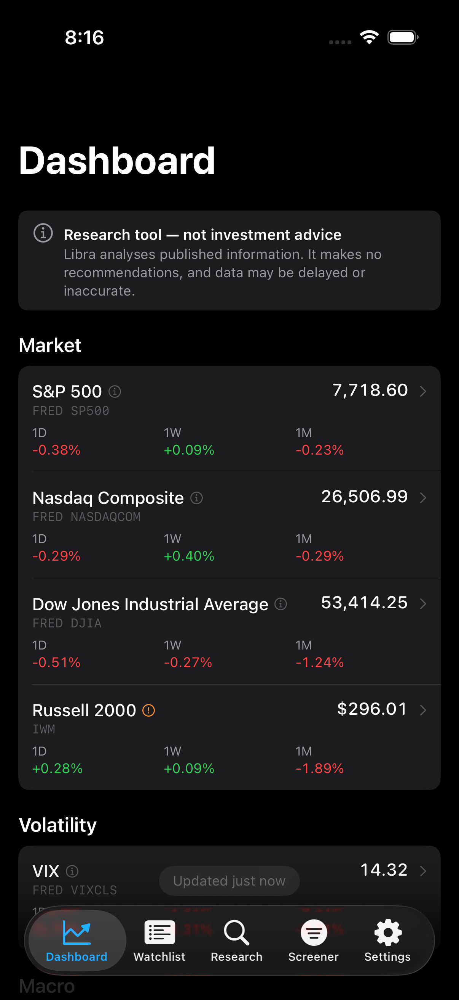
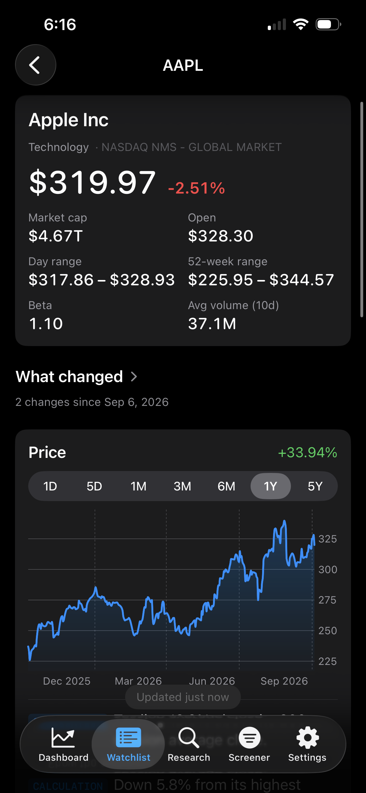
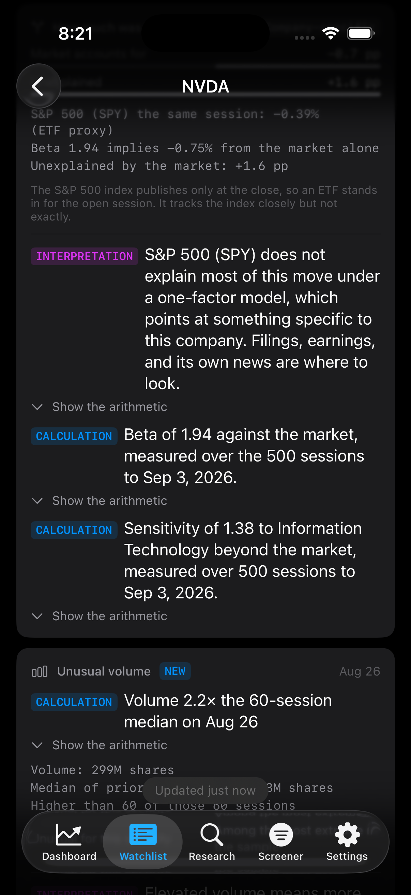
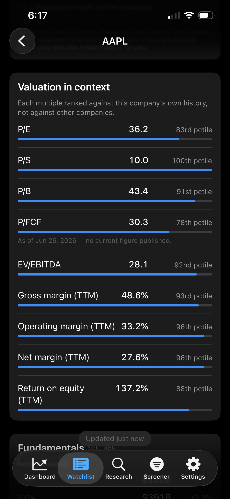
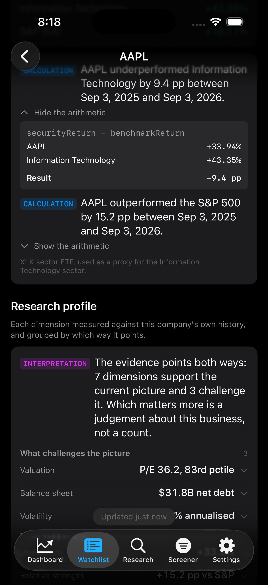
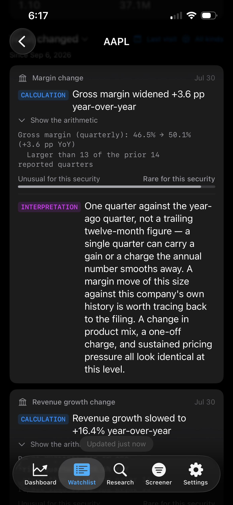
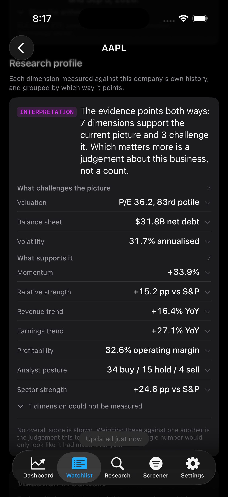
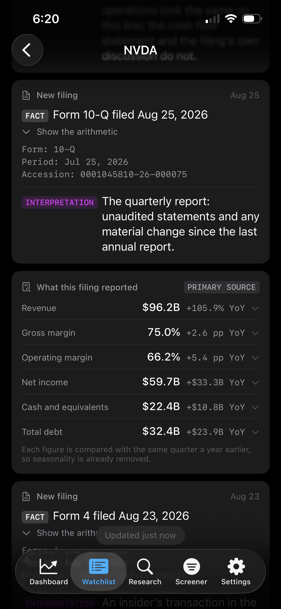
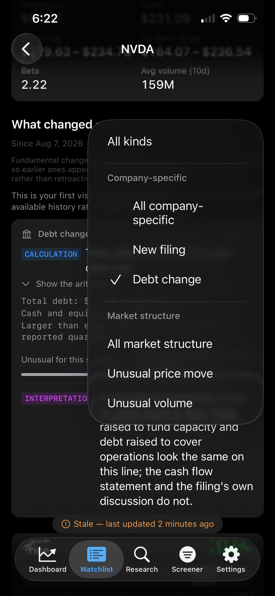

# Libra

An iOS research tool that answers *what changed, why, and how unusual is it* —
for a small number of companies you actually follow.

  
  
  

> **Educational and informational purposes only.** Libra is a research tool.
> It is **not investment advice**, not a recommendation to buy or sell any
> security, and carries **no warranty as to the accuracy, completeness or
> timeliness of any data shown**. All data comes from third-party providers and
> may be delayed, incomplete or wrong. Nothing here is a solicitation, and
> nothing here should be relied on to make a financial decision. Do your own
> research and consult a licensed professional.

## What problem it solves

A conventional stock app tells you a position is down 3%. That is the least
interesting true thing available about it. What a person actually wants to know
is whether 3% is large for *this* company, how much of it was the market
dragging everything down, whether anything in the last filing moved underneath
the price, and whether any of it is worth an hour of reading.

Libra is built around that question. It watches a handful of companies,
detects changes that are unusual *relative to each company's own history*,
separates the market's contribution from the company's, and shows the
arithmetic behind every figure so a reader can reject it. It never produces a
score, a rating, or a recommendation.

## Design decisions

These are the parts worth reading. Each one is a case where the obvious
implementation produces something confident and wrong.

**No overall buy/sell score.** The original specification called for a
"Research Signal: 82/100" with a breakdown behind it. The breakdown is built —
eleven dimensions, each with its own yardstick — and the number deliberately is
not. A P/E ranked against a company's own ten-year history means something.
Averaged with an insider-transaction count and a volatility rank, it means
nothing at all, while looking more authoritative than either input. The
components are what a reader can act on; the total would only look like it.
The same reasoning refuses a recommendation anywhere in the app.

The app says this on screen rather than only in a readme: *"No overall score is
shown. Weighing these against one another is the judgement this tool leaves to
you — a single number would only look like it had made it for you."* Underneath
it, each multiple is ranked against the company's own past — NVDA at a P/E in
the 42nd percentile of its own range while its P/B sits in the 87th, which is a
more useful pair of facts than either multiple alone. Dimensions that cannot be
measured are counted and named, never quietly folded in as neutral.

 

**There is no AI anywhere in the app.** Every number — returns, betas,
percentiles, margins, anomaly ranks — is pure Swift over data already fetched,
with no model in the path. Given the same inputs it produces the same output,
and those functions are unit-tested. A language model that invents a plausible
P/E is indistinguishable from one that reports a real one, and in a tool whose
entire purpose is separating measured figures from derived ones, that is the
worst available failure. The specification called for an optional summarisation
layer and a settings slot for an API key existed for a while; it was removed
rather than left as a stub, because a key field that stores a credential nothing
ever reads is a promise the app does not keep.

**Unusualness is a rank, never a probability.** A detector reports "larger than
248 of the past 250 sessions", not "a 1-in-370 event". The second phrasing
requires daily returns to be normally distributed, and they are not — 3σ days
arrive several times a year. Converting a z-score into a probability would put
a wildly overstated rarity on screen, dressed in the language of statistics.
Rank is both true and checkable against the data. A real detection reads
*"Move: +8.74% — larger than every one of the prior 250 closed sessions — 2.9×
the typical daily move (median absolute deviation)"*, and the attribution
beneath it splits that move into what the market accounts for and what it does
not, in percentage points, with the beta and the ETF substitution both named.

**Anomalies use median and MAD, not mean and standard deviation.** A standard
deviation computed over a window that contains the spike is inflated by that
spike, which shrinks its own score and then hides the *next* spike behind a
permanently widened band. Median absolute deviation does not have this problem.
Relatedly, an observation is always excluded from the sample it is ranked
against: a value cannot be its own yardstick.

**Relative performance is measured against both the sector and the index.** A
stock down 6% on a day the market fell 5% is a completely different situation
from the same 6% on a flat day, and most apps render them identically. The
split is beta-adjusted — a raw security-minus-market difference understates the
market's contribution for a high-beta name — with the beta shown alongside so
it can be rejected, and fitted over roughly two years rather than all available
history, because beta is not a constant and a five-year fit averages in a
sensitivity the company no longer has. The sector leg is orthogonalised against
the market leg so the two are not double-counted. The model is one factor, and
the app says so rather than implying more.

**Margins and multiples are percentiled against the company's own history, not
against peers.** A software firm at a P/E of 31 and a utility at 31 are not
comparable in any useful way, but a company against its own range is. A minimum
sample of eight observations is required — a weak percentile presented as a
strong one is worse than no percentile. A multiple that cannot be meaningfully
ranked is shown and flagged rather than silently dropped: a negative P/E ranked
naively lands at the 0th percentile and reads as *cheap* when it means the
company is losing money.

**Synthetic data is refused at the door, not flagged.** Running without API keys
produces sample data so the interface is explorable. An earlier version recorded
that sample data to the same store as real data; every read afterwards preferred
it to spending a request, and a live quote appeared beside a chart computed from
an invented series. Every write now names its provider and a synthetic write is
dropped — a flag would have to be honoured by every read path forever, and the
read that matters is the one a screen uses precisely when it is trying *not* to
spend a request. The app also evicts what earlier builds already wrote.

**Absent data renders "Not available", never 0.** Fabricating a value is worse
than showing nothing, and a zero is a fabrication that formats like a
measurement.

**Percentage points are not percent.** Relative performance and margin changes
report `pp` throughout. Cash flow in particular is compared in percentage points
because free cash flow crosses zero regularly, and a percentage change through
zero is either infinite or sign-flipped — a company going from -$10M to +$10M
has improved, and "-200%" describes that improvement as a collapse.

**Every statement declares its epistemic status.** `Claim` and `ClaimKind` make
FACT / CALCULATION / INTERPRETATION / HYPOTHESIS a type-level property: a
statement cannot be constructed without saying which it is, and the badge is
visible on screen. This is enforced by the compiler rather than by UI
convention.

**Persistence is append-only.** Every record carries `observedAt` separately
from the period it describes, and a restatement inserts a new row rather than
overwriting one. This is what makes "what did this look like three months ago"
answerable, and it cannot be retrofitted later.

**Fundamentals are compared year-over-year, never quarter-over-quarter.** Most
businesses are seasonal; a retailer's Q4 gross margin is not comparable to its
Q3, and a detector built on consecutive quarters fires every December and
reports the calendar as news. The year-earlier period is matched by date rather
than by counting back four, because a 52/53-week fiscal calendar moves the
closing date between years.

**A proxy is labelled a proxy on every screen that shows it.** The S&P 500, Dow,
Nasdaq and VIX are the real index series from FRED. The eleven GICS sectors have
no free index equivalent, so they are SPDR sector ETFs and say so in as many
words. FRED publishes end-of-day only, so index-backed pages offer 1M through 5Y
and no intraday range at all — serving SPY's intraday chart under the heading
"S&P 500" is exactly the substitution the labelling exists to prevent, so the
range is not offered rather than filled with something else.

## What it shows

**Dashboard.** Four indexes and the VIX from FRED, four macro readings, and the
eleven GICS sectors as a daily-change grid. Every row opens a price chart with
its own range picker. Deliberately restrained — the things that explain a move
live on the screens with room to show the reasoning.

**Watchlist.** Companies you follow, with search and add. Quotes only, never
history: one history request per row would exhaust a free Tiingo quota on a list
of any size.

**Security Detail.** Price chart with ranges from 1D to 5Y (intraday where an
Alpaca key is present), valuation multiples with their historical percentiles,
profitability and balance-sheet figures extracted from XBRL, filing history with
a per-filing analysis of what each document actually reported against the same
period a year earlier, insider transactions summarised by whether they were
discretionary, and the *What Changed* panel.

**What Changed.** The core of it. Since your last visit: price moves, volume and
volatility anomalies ranked against the security's own history, and fundamental
changes dated to when they were *filed* rather than to the period they cover — a
June quarter disclosed in August is news in August. A first visit reports nothing
as new, because with no prior visit there is no "since". An open session is
provisional and is never written to the permanent record: a +8% reading at midday
can close at +2%.

**Research profile.** Eleven dimensions — momentum, relative strength, revenue
and earnings trend, profitability, valuation, balance sheet, analyst posture,
insider activity, sector strength, volatility — each with the yardstick it was
measured against, each classified from its own arithmetic rather than after the
conclusion is known, and a deliberate search for the evidence that argues the
other way. No total.

**Screener.** Screens what the app already holds — your watchlist plus anything
visited — reading only from the store and issuing no requests. Free tiers make
screening a real universe impossible, and a screen that quietly examined six
stocks while looking like it examined six thousand would be worse than none. The
coverage is stated on screen.

  
  
  
  
  

## Setup

Libra is **bring-your-own-key**. It ships no market data and redistributes
none: you create free accounts, and the app calls the providers as you. That is
an architectural choice as much as a licensing one — every provider's free tier
forbids redistribution, and holding no data means there is nothing to
redistribute.

| Provider | Account | Used for |
|---|---|---|
| **Finnhub** | Free key, `finnhub.io` | Quotes, company profiles, fundamental metrics, ratings, news |
| **Tiingo** | Free key, `tiingo.com` | Daily price history — charts, moving averages, volatility |
| **FRED** | Free key, `fred.stlouisfed.org` | Index levels (S&P 500, Dow, Nasdaq, VIX) and macro series |
| **SEC EDGAR** | **No key** — a contact email address | Filings, XBRL financial statements, Form 4 insider transactions |
| **Alpaca** | Free key pair, `alpaca.markets` | Optional — intraday bars for the 1D and 5D charts (IEX feed) |

Keys are entered in **Settings → Data sources**, one screen per key. They go
straight to the iOS Keychain and are never written to the app's database, never
logged, never included in a cache key, and never read back into the UI. There is
no configuration file to edit and nothing to commit by accident. Each row has a
**Test connection** button that verifies a key by actually using it, because a
mistyped key otherwise looks identical to a working one until some unrelated
screen renders empty an hour later.

Without keys the app runs on clearly-labelled sample data. Those numbers are
randomly generated, they are marked as such on every screen that shows them, and
they are refused entry to the database.

### Building

Requires Xcode 26, an iOS 26 simulator, and
[XcodeGen](https://github.com/yonaskolb/XcodeGen).

    brew install xcodegen
    xcodegen generate
    open Libra.xcodeproj

The `.xcodeproj` is generated, not committed — edit `project.yml`. Code signing
must be enabled: an unsigned build carries no Keychain entitlement, and every key
you enter then silently fails to save.

    xcodebuild -project Libra.xcodeproj -scheme Libra \
      -destination 'platform=iOS Simulator,name=iPhone 17 Pro' test

416 tests. Provider tests decode captured payloads through the full mapping path
via a stubbed `URLSession`; no test touches the network.

## Status

Honest about what is finished. Libra is a personal project under active
development, not a product. The authoritative record is
[ROADMAP.md](ROADMAP.md), which this table summarises.

| Area | Status |
|---|---|
| Foundation — architecture, SwiftData models, provider abstraction, secrets, navigation | Complete |
| Market data — quotes, history, watchlist, charts, intraday, benchmark pages | Complete |
| Fundamentals — XBRL extraction, valuation percentiles, historical snapshots | Complete |
| SEC — filings, Form 4 parsing, insider summaries, per-filing figure analysis | Complete |
| Analyst & news | **Partial.** Ratings and earnings surprises are wired in. Estimate revisions require a paid Finnhub tier and surface as "not in your plan". News is fetched and displayed nowhere |
| Intelligence — What Changed, relative analysis, research profile, disconfirming evidence | Complete |
| Personal research — screener, saved screens | **Partial.** The screener works over held data. A research journal was built and then removed: it asked the reader to write the analysis the app is supposed to produce |
| Polish — caching, error handling, accessibility, testing | **Partial.** Read-through caching, offline fallback and an accessibility pass on drawn elements are done. iPad layout and a Dynamic Type sweep are outstanding |

**Known limitations**, kept current in the roadmap:

- The XBRL fundamentals are unit-tested against captured filings, but no figure
  on the Security Detail page has been read back against the 10-Q it came from.
- Form 4 parsing has not been run against a live ownership document, only
  against a hand-authored fixture.
- A stored price bar names the composite provider rather than the vendor that
  supplied it — sufficient for the real-or-synthetic guard, wrong as provenance.
- Volatility regime changes are not backfilled across a gap between visits;
  price moves and volume are.
- An event read back from the store loses its derivation and renders as a FACT
  rather than the CALCULATION it was — the app mislabelling its own epistemic
  status, which is precisely what the `Claim` type exists to prevent.
- Alpaca's free tier is the IEX feed, roughly 2.5% of US volume. It is used for
  intraday chart *shape* only and never reaches a volume detector, where it
  would be meaningless.
- Tiingo's free tier allows roughly 50 requests per hour, which is the binding
  constraint on anything wanting history for many symbols.

## Built with

Swift 6 with strict concurrency, SwiftUI, SwiftData, Swift Charts, Swift Testing
and XcodeGen. No third-party dependencies.

## Data sources and notices

This product uses the FRED® API but is not endorsed or certified by the Federal
Reserve Bank of St. Louis.

Market and fundamental data are supplied by Finnhub, Tiingo, Alpaca, FRED and
SEC EDGAR under each reader's own account and each provider's own terms. This
repository contains no licensed market data. The files under
`LibraTests/Fixtures/` are small trimmed API responses retained solely to
exercise decoding, and EDGAR content is United States Government work in the
public domain.

## Licence

MIT — see [LICENSE](LICENSE).

Tyler Abitbol
