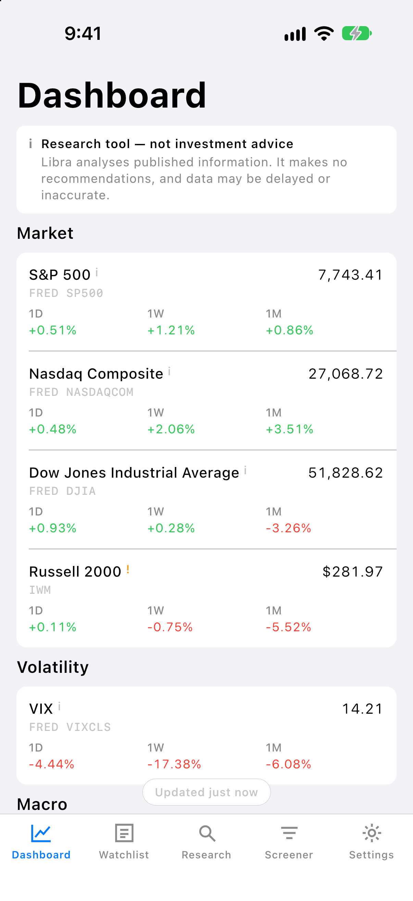
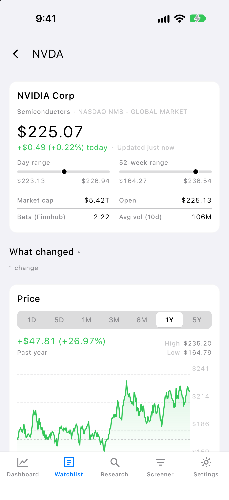
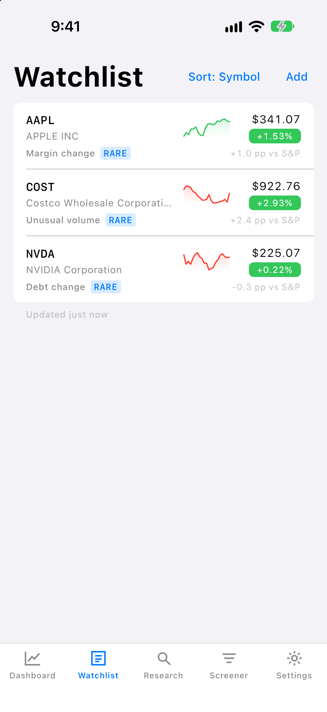
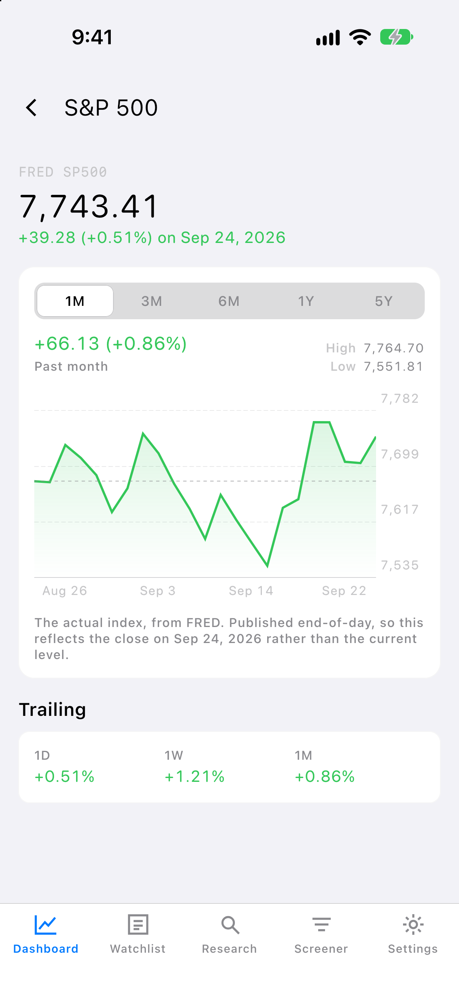
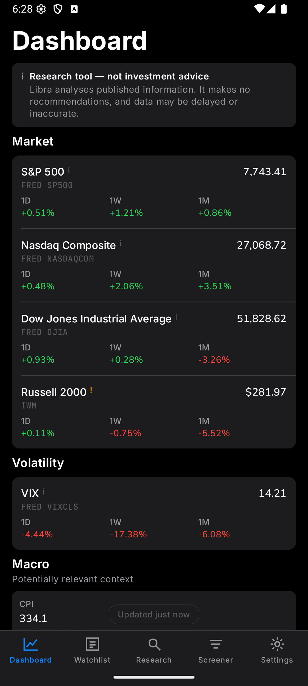
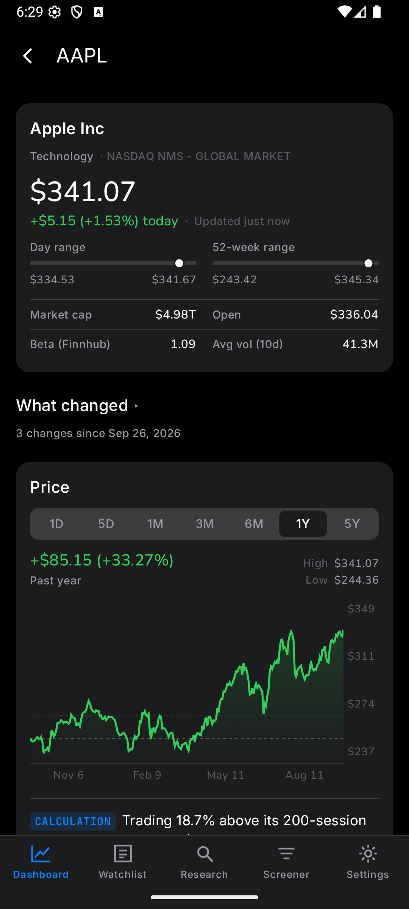
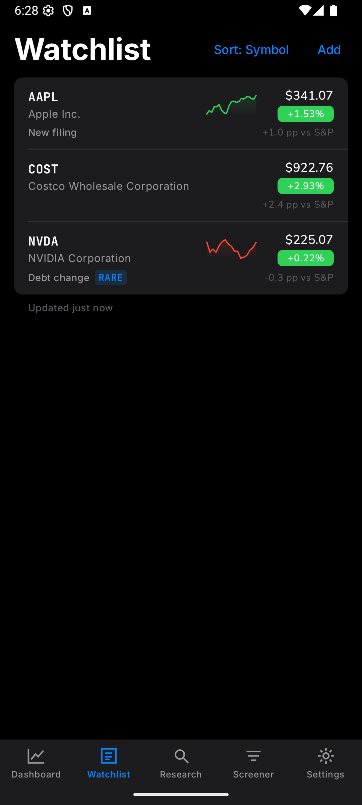
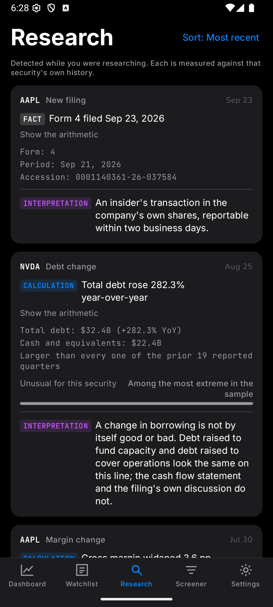

# Libra

An equity research tool for iOS and Android that answers *what changed, why,
and how unusual is it*, for a small number of companies you actually follow.
Built with Kotlin Multiplatform and Compose Multiplatform: one codebase, two
native apps.

<p align="center">
  
  
  
  
</p>
<p align="center">
  
  
  
  
</p>

<p align="center"><sub>Every screen in light and dark, on both platforms, is in <a href="docs/refresh/"><code>docs/refresh/</code></a>.</sub></p>

> **Educational and informational purposes only.** Libra is a research tool.
> It is **not investment advice**, not a recommendation to buy or sell any
> security, and carries **no warranty as to the accuracy, completeness or
> timeliness of any data shown**. All data comes from third-party providers and
> may be delayed, incomplete or wrong. Do your own research and consult a
> licensed professional.

Libra started as a SwiftUI app. That version is archived on the
[`swift-app`](../../tree/swift-app) branch, and its README's *Design decisions*
section still describes this app: every calculation was ported and checked
against it. The principles hold here too: no overall score, no rating, no
recommendation and no AI anywhere in the numbers.

## What's new since the Swift app

- **Android.** The same app on Android, from the same code as iOS.
- **Dark mode and Libra's own palette.** Neutral near-black on near-white, with
  colour kept for a gain, a loss or a caution. SF Pro and SF Pro Rounded on iOS;
  Inter, Nunito and JetBrains Mono bundled on Android.
- **Charts that say what the line did.** A summary strip above each chart with
  the move over the range, the line coloured by direction against the
  window's first close, a rule at the starting close, press-and-drag to scrub
  (with a light haptic on each step), and a range picker whose indicator slides.
- **A tighter stats block.** Day range and 52-week range as bars with a marker at
  the current price, and market cap, open, beta and average volume in a compact
  grid.
- **Hero price** on the security and benchmark pages, rolling to each new value.
- **Watchlist.** A one-month sparkline and a change pill on every row, swipe to
  remove, a long-press menu to open or remove, and one tap to add starter
  symbols to an empty list.
- **Pull to refresh** on the Dashboard, Watchlist and security pages.
- **Loading and motion.** Placeholder shapes on first load in place of spinners,
  crossfades between screens, and Reduce Motion respected throughout.
- **A faster Dashboard.** Each group of rows appears as soon as its data lands,
  and the rows survive switching tabs instead of reloading.
- **The arithmetic re-checked.** Every calculation was audited against worked
  answers, and the fixes are covered by tests.

## Working on it

The plans behind the port, all finished, are indexed in
[docs/README.md](docs/README.md). `RESUME.md` (where the work stands) and
`KNOWN_ISSUES.md` (every deviation from the Swift original, and what is still
open) are working notes kept locally, not in the repository, so code comments
that cite them point at a file only a working copy has.

## Layout

- `core/` — KMP library, no Compose. Calculations, models, networking,
  persistence, providers, secrets, view models, and `AppLaunch`, the launch
  sequence both shells share.
- `app/` — Compose Multiplatform UI, as a KMP library. Produces the `LibraKit`
  framework that the iOS shell links. Its `iosMain` holds
  `MainViewController.kt`, the iOS shell proper.
- `androidApp/` — thin Android shell: `LibraApplication`, `MainActivity`,
  manifest, theme, launcher icon.
- `iosApp/` — thin Xcode shell, generated by XcodeGen from `project.yml`.
  Both `Libra.xcodeproj` and `Info.plist` are generated; neither is committed.

## Toolchain

JDK 21, Android SDK (compile 37, min 26), Xcode 27, XcodeGen.
Use an iOS 27 simulator: the 26.5 runtime on this machine is broken.
Installed here via Homebrew; `local.properties` points at the SDK.

Everything large is relocatable: `GRADLE_USER_HOME`, `ANDROID_HOME`
(+ `sdk.dir`), `KONAN_DATA_DIR`.

Gradle needs a JDK pointed at explicitly, in every shell:

```sh
export JAVA_HOME=/opt/homebrew/opt/openjdk@21/libexec/openjdk.jdk/Contents/Home
```

## Tests

```sh
./gradlew :core:jvmTest                # fast loop — the whole of :core, ~seconds
./gradlew :core:iosSimulatorArm64Test  # the same tests, on the iOS simulator
./gradlew :app:iosSimulatorArm64Test   # the Compose UI tests
./gradlew :core:allTests               # everything :core runs, every target
```

The `:app` UI tests are Compose `runComposeUiTest` suites in
`app/src/commonTest`, and they run on **`iosSimulatorArm64`** — there is no
desktop target to run them on, and Android instrumentation would need a device.
The first run builds the test binary and costs ~21 minutes; later runs are
15–40 seconds.

## Build and run

Android:

```sh
./gradlew :androidApp:assembleDebug
./gradlew :androidApp:installDebug     # needs a device or emulator
```

iOS:

```sh
cd iosApp && xcodegen generate         # after any project.yml change
xcodebuild -project Libra.xcodeproj -scheme Libra \
  -destination 'platform=iOS Simulator,name=iPhone 18 Pro' build
```

Xcode builds the Kotlin framework itself, through the target's
`embedAndSignAppleFrameworkForXcode` pre-build script, so opening
`Libra.xcodeproj` and pressing Run is enough.

To run it from a terminal instead, note that `open -a Simulator` fails and
always will: Xcode 27 replaced Simulator with DeviceHub and moved the developer
apps out of `Contents/Developer/Applications`, which `xcode-select -p` points
at. The window you want is:

```sh
open "/Applications/Xcode.app/Contents/Applications/DeviceHub.app"
xcrun simctl boot 'iPhone 18 Pro'
xcrun simctl install booted <path-to>/Libra.app
xcrun simctl launch booted com.tylerabitbol.libra
```

Boot the simulator with its window on screen before judging anything you see.
A device booted headlessly still installs, launches and screenshots, but it does
not drive the display link, so Compose renders only when poked and a screenshot
can show a stale frame.

## API keys

The app ships with none. Enter them in Settings → Data Sources, which writes
them to the iOS Keychain or the AndroidKeyStore-backed store; nothing is
compiled in, and nothing is read from the repository. Each row has its own
"Test connection".

## Developer launch options

Debug builds only — `DeveloperOptions` gates every one of them on the build
configuration, so a release build ignores an argument that reaches it.

iOS takes them as launch arguments and environment variables:

```sh
xcrun simctl launch booted com.tylerabitbol.libra -LibraOpenSymbol AAPL
xcrun simctl launch booted com.tylerabitbol.libra -LibraSeedWatchlist
SIMCTL_CHILD_LIBRA_FINNHUB_KEY=… xcrun simctl launch booted \
  com.tylerabitbol.libra -LibraSeedKeys
```

Android has no argv, so the same options travel as extras on the launching
intent: a `Libra…` extra becomes the `-Libra…` argument, and a `LIBRA_…` extra
stands in for an environment variable.

```sh
adb shell am start -n com.tylerabitbol.libra/.MainActivity \
  -e LibraOpenSymbol AAPL
```

`-LibraSelfTest` runs the secure-storage and connection checks and writes the
result to the log; on iOS that is the only way to verify the Keychain, because
a test bundle has no entitlements and every Keychain call in one fails before
anything else is evaluated.

## Data sources and notices

This product uses the FRED® API but is not endorsed or certified by the Federal
Reserve Bank of St. Louis.

Market and fundamental data are supplied by Finnhub, Tiingo, Alpaca, FRED and
SEC EDGAR under each reader's own account and each provider's own terms. This
repository contains no licensed market data.

## Licence

MIT, see [LICENSE](LICENSE).
